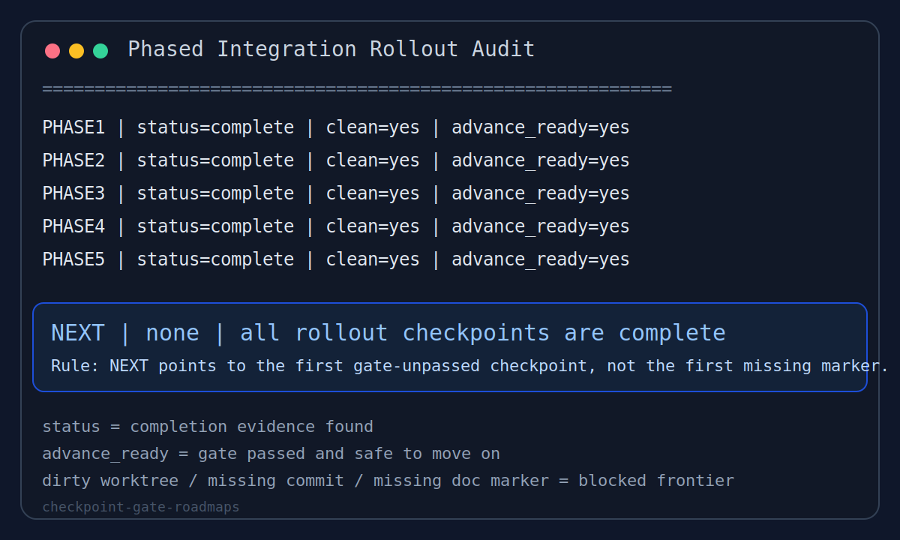

# checkpoint-gate-roadmaps

[](https://github.com/zhibo0502/checkpoint-gate-roadmaps/actions/workflows/ci.yml)

A Codex skill for turning roadmap progress into an evidence-backed checkpoint audit. It treats `NEXT` as the first gate-unpassed checkpoint, not the first unfinished task.

一个可复用的 Codex skill，用于把路线图、MVP 计划、集成流程或 rollout 过程变成证据驱动的 checkpoint 审计系统。它把 `NEXT` 定义为第一个 gate 尚未通过的 checkpoint，而不是第一个“还没做完的任务”。



## What It Solves

Use this skill when a roadmap should only move forward after the current checkpoint has really passed:

- ordered checkpoints such as `MVP1..MVP10`, `Phase 1..4`, or `Slice 1..5`
- a stable `NEXT` that points to the first gate-unpassed checkpoint
- explicit blocking on dirty worktrees, missing doc markers, missing commits, or failed verification
- optional derived snapshots without replacing the real audit logic

适用场景：

- 有顺序的 checkpoint，例如 `MVP1..MVP10`、`Phase 1..4`、`Slice 1..5`
- 需要稳定的 `NEXT` 语义，始终指向第一个 gate 尚未通过的 checkpoint
- dirty worktree、缺 commit、缺文档收口标记、缺验证结果时必须阻止自动推进
- 想保留 snapshot 方便恢复线程，但又不想让 snapshot 变成唯一真源

## Why This Is Not A Generic Roadmap Skill

Most roadmap skills help generate a plan, summarize progress, or list the next unfinished task. This skill is narrower and stricter: it audits whether the current checkpoint is actually safe to advance.

- A generic roadmap skill asks "what is the next item on the plan?"
- This skill asks "what is the first gate-unpassed checkpoint?"
- A generic progress tracker may move on as soon as implementation looks complete.
- This skill keeps `NEXT` pinned to the current checkpoint until completion evidence and gate conditions both pass.
- A generic planner can rely on prose status updates.
- This skill expects durable evidence such as commits, doc markers, verification output, and clean worktree state.

## Repository Contents

- `SKILL.md`: main skill body
- `agents/codex.yaml`: display metadata for Codex
- `demo/`: self-contained runnable public demo
- `tests/`: smoke tests for the public demo and public wording
- `examples/`: walkthroughs and scenario-based examples
- `assets/roadmap-audit-preview.svg`: static visual showing audit output shape

## Install

Copy this directory into your Codex skills directory:

```text
$CODEX_HOME/skills/checkpoint-gate-roadmaps
```

Recommended final path:

```text
$CODEX_HOME/skills/checkpoint-gate-roadmaps/SKILL.md
```

## Runnable Demo

This repository includes a public, self-contained demo that does not depend on any external project context.

Run it directly:

```text
python demo/check_demo_roadmap.py
```

Expected shape:

```text
ROADMAP | Public Demo Roadmap
...
NEXT | CP2 | Core implementation
```

Output formats — text (default), JSON, or Markdown:

```text
python demo/check_demo_roadmap.py --format json
python demo/check_demo_roadmap.py --format markdown
```

Persist a machine-readable audit snapshot for resumable batch gates:

```text
python demo/check_demo_roadmap.py --json-out CHECKPOINT_STATUS.json
```

The JSON snapshot is derived from the live evaluator and includes
`snapshot_schema_version`, `roadmap_name`, `checkpoints`, the
backward-compatible `next` key, and a final `NEXT` object with `status`,
`advance_ready`, `evidence`, and `missing`. Write it next to run artifacts when
a later session needs to resume from the current frontier without trusting
conversation state.

The generated snapshot also validates against `demo/snapshot_schema.json`, which
is separate from the fixture schema because snapshots are derived outputs rather
than user-authored roadmap inputs.
`blocking_reason` is derived from the current `NEXT`; it is a convenience field
for operators and automation logs, not a replacement for per-checkpoint
`missing`.

Validate a fixture against the JSON Schema before evaluation:

```text
python demo/check_demo_roadmap.py --validate --fixture path/to/roadmap.json
```

Use an explicit non-zero exit code for CI or unattended automation:

```text
python demo/check_demo_roadmap.py --fail-on-blocked
```

`--fail-on-blocked` preserves the normal output format but exits `2` when
`NEXT` still points to a blocked checkpoint. Without this flag, the CLI remains
read-only and exits `0` after rendering a valid audit report.

Run the smoke tests:

```text
python -m unittest discover -s tests -p "test_*.py"
```

这个仓库现在自带一个公开可运行 demo，不依赖任何外部项目上下文。任何人 clone 后都可以直接运行：

```text
python demo/check_demo_roadmap.py
```

它演示的核心规则是：

- `NEXT` 指向第一个 gate 未通过的 checkpoint
- 不是简单地指向“第一个少一个标记”的 checkpoint
- 当当前 checkpoint 已完成但 gate 仍失败时，`NEXT` 必须停留在当前 checkpoint

## Git-Backed Collector Demo

The repository also includes a git-backed collector that reads real repository state (commits, worktree cleanliness, file existence) and feeds it into the same evaluator:

```text
python -m demo.git_collector_example --repo /path/to/repo
```

This demonstrates the "repo-backed collector" pattern from SKILL.md — evidence is collected from `git log`, `git status`, and file checks rather than a static JSON fixture.

还提供了一个 git-backed collector，从真实仓库状态（commit、worktree 是否干净、文件是否存在）收集证据，输入到同一个评估器：

```text
python -m demo.git_collector_example --repo /path/to/repo
```

## Core Contract

The skill is built around four fields per checkpoint:

- `status`
- `advance_ready`
- `evidence`
- `missing`

And one order-sensitive frontier rule:

- `NEXT` must point to the first checkpoint where either `status != complete` or `advance_ready != yes`

When every checkpoint is complete and gate-clean, the expected terminal state is:

```text
NEXT | none | all checkpoints are complete
```

The JSON snapshot uses the same frontier rule:

```json
{
  "snapshot_schema_version": 1,
  "roadmap_name": "Public Demo Roadmap",
  "checkpoints": [
    {
      "key": "CP2",
      "name": "Core implementation",
      "status": "complete",
      "advance_ready": "no",
      "evidence": ["commit_subject", "update_log_marker", "verification_green"],
      "missing": ["worktree_clean"]
    }
  ],
  "next": "CP2",
  "NEXT": {
    "key": "CP2",
    "name": "Core implementation",
    "status": "complete",
    "advance_ready": "no",
    "evidence": ["commit_subject", "update_log_marker", "verification_green"],
    "missing": ["worktree_clean"]
  },
  "blocking_reason": "CP2 is complete but cannot advance because gates are failing: worktree_clean"
}
```

## Fixture Format

The demo CLI reads a JSON file with the following structure:

```json
{
  "roadmap_name": "string — display name for the audit report",
  "checkpoints": [
    {
      "key":  "string — stable identifier (e.g. CP1, MVP3, STAGE5)",
      "name": "string — short human label",
      "done_evidence": [
        { "label": "string — evidence type", "found": true }
      ],
      "gate": [
        { "label": "string — gate condition", "passed": false }
      ]
    }
  ]
}
```

- `done_evidence[].found`: `true` if evidence exists, `false` otherwise. Drives `status`.
- `gate[].passed`: `true` if condition met. All gates must pass for `advance_ready=yes`.
- Checkpoints are evaluated in array order; `NEXT` is the first that fails.

Fixture 格式说明：

- `done_evidence[].found`：证据是否存在，决定 `status`（全部 true = complete，部分 = in_progress，全 false = pending）
- `gate[].passed`：gate 条件是否满足，全部 true 才能 `advance_ready=yes`
- checkpoint 按数组顺序评估，`NEXT` 指向第一个未通过的

## Scenario Examples

This repository includes descriptive examples that show the same audit contract in different roadmap shapes:

- [Public Demo Walkthrough](examples/public-demo.md)
- [Ten-Stage Delivery Program](examples/ten-stage-delivery-program.md)
- [Post-Release Integration Rollout](examples/post-release-integration-rollout.md)

## Versioning

This repository uses lightweight semantic versioning for published snapshots of the skill.

- initial published release: `v0.1.0`
- current release in this iteration: `v0.2.0`

See [CHANGELOG.md](CHANGELOG.md) for release-level notes.

## License

Released under the [MIT License](LICENSE).
