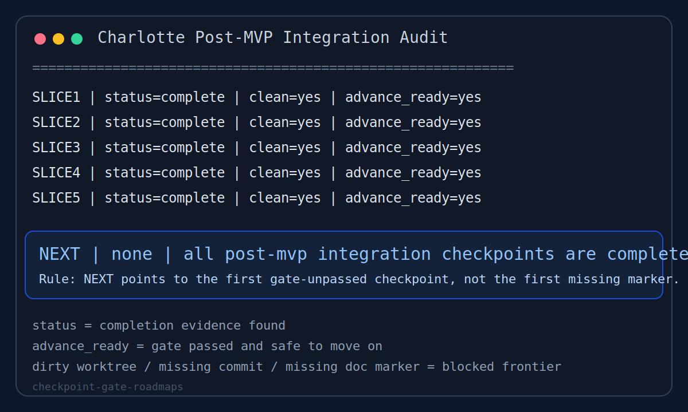

# checkpoint-gate-roadmaps

[](https://github.com/zhibo0502/checkpoint-gate-roadmaps/actions/workflows/ci.yml)

A reusable Codex skill for roadmap audits that need explicit checkpoints, gate-based auto-advance, and durable `NEXT` semantics.

一个可复用的 Codex skill，用于把路线图、MVP 计划、集成流程或 rollout 过程做成可审计的检查点系统，并用明确的 gate 规则驱动自动推进。



## What It Solves

Use this skill when a roadmap should only move forward after the current checkpoint has really passed:

- ordered checkpoints such as `MVP1..MVP10`, `Phase 1..4`, or `Slice 1..5`
- a stable `NEXT` that points to the first gate-unpassed checkpoint
- explicit blocking on dirty worktrees, missing doc markers, missing commits, or failed verification
- optional derived snapshots without replacing the real audit logic

适用场景：

- 有顺序的 checkpoint，例如 `MVP1..MVP10`、`Phase 1..4`、`Slice 1..5`
- 需要稳定的 `NEXT` 语义，始终指向第一个 gate 尚未通过的 checkpoint
- dirty worktree、缺 commit、缺文档收口标记、缺验证结果时必须阻止自动推进
- 想保留 snapshot 方便恢复线程，但又不想让 snapshot 变成唯一真源

## Repository Contents

- `SKILL.md`: main skill body
- `agents/openai.yaml`: display metadata for Codex
- `demo/`: self-contained runnable public demo
- `tests/`: smoke tests for the public demo
- `examples/`: walkthroughs and project-grounded examples
- `assets/charlotte-audit-preview.svg`: static visual showing audit output shape

## Install

Copy this directory into your Codex skills directory:

```text
$CODEX_HOME/skills/checkpoint-gate-roadmaps
```

Recommended final path:

```text
$CODEX_HOME/skills/checkpoint-gate-roadmaps/SKILL.md
```

## Runnable Demo

This repository now includes a public, self-contained demo that does not depend on the Charlotte codebase.

Run it directly:

```text
python demo/check_demo_roadmap.py
```

Expected shape:

```text
ROADMAP | Public Demo Roadmap
...
NEXT | CP2 | Core implementation
```

Run the smoke tests:

```text
python -m unittest tests/test_demo_roadmap.py
```

这个仓库现在自带一个公开可运行 demo，不再依赖 Charlotte 私有代码。任何人 clone 后都可以直接运行：

```text
python demo/check_demo_roadmap.py
```

它演示的核心规则是：

- `NEXT` 指向第一个 gate 未通过的 checkpoint
- 不是简单地指向“第一个少一个标记”的 checkpoint
- 当当前 checkpoint 已完成但 gate 仍失败时，`NEXT` 必须停留在当前 checkpoint

## Core Contract

The skill is built around four fields per checkpoint:

- `status`
- `advance_ready`
- `evidence`
- `missing`

And one order-sensitive frontier rule:

- `NEXT` must point to the first checkpoint where either `status != complete` or `advance_ready != yes`

When every checkpoint is complete and gate-clean, the expected terminal state is:

```text
NEXT | none | all checkpoints are complete
```

## Charlotte Examples

This skill was used to drive Charlotte's:

- ten-MVP owner-worktree audit
- post-MVP integration slice audit
- child integration-pack checkpoint audit

Public examples in this repository:

- [Public Demo Walkthrough](examples/public-demo.md)

Project-grounded examples:

- [Charlotte Ten-MVP Program](examples/charlotte-ten-mvp-program.md)
- [Charlotte Post-MVP Integration](examples/charlotte-post-mvp-integration.md)

## Versioning

This repository uses lightweight semantic versioning for published snapshots of the skill.

- initial published release: `v0.1.0`
- current release in this iteration: `v0.1.1`

See [CHANGELOG.md](CHANGELOG.md) for release-level notes.

## License

Released under the [MIT License](LICENSE).
